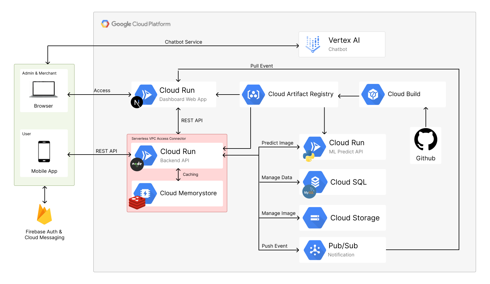

# Surevenir Backend Service

<div align="center">

</div>

Surevenir Backend Service is the backend infrastructure for the Surevenir application, built using **TypeScript**, **Express**, and **Prisma ORM**. This project provides APIs to handle the business logic and database operations, ensuring a robust backend for the Surevenir app.

## Core Technology

- **TypeScript Integration**: Ensures a statically-typed codebase for better maintainability.
- **Express Framework**: A flexible and lightweight web server for handling API routes.
- **Prisma ORM**: Simplifies database access and management with an intuitive schema-based approach.
- Modular folder structure for scalability and maintainability.
- Environment-based configuration using `.env` for secure and portable setups.

## Features
Our API provides comprehensive functionality to support the core operations of the application, grouped into distinct modules for efficient management and scalability. The APIs include 56 endpoints, along with 1 endpoint dedicated to the Machine Learning Prediction API.
- **User Management**: Facilitates user operations such as creating, updating, deleting, and retrieving user information. This module ensures smooth management of user accounts and their associated data.
- **Category Management**: Enables the creation, modification, deletion, and retrieval of categories, providing an organized structure for classifying items in the application.
- **Market Management**: Handles all aspects of market operations, including creating and updating market details, managing market images, retrieving market data, and listing merchants associated with a specific market.
- **Merchant Management**: Supports merchant-related functionalities like creating, updating, and deleting merchant profiles. It also provides tools for retrieving merchant details and their associated products.
- **Product Management**: Manages product-related operations, including adding, updating, and deleting products, handling user favorites, and listing reviews for products. It also supports querying top-favorited products and retrieving products by specific identifiers.
- **Cart and Checkout**: Offers features for managing shopping cart items, including adding, updating, and removing products. It also supports the checkout process and provides tools for managing and viewing checkout records.
- **Review System**: Allows users to submit reviews, retrieve reviews for specific products, and manage (delete) reviews. This module promotes user engagement and feedback on products.
- **Image Management**: Handles the addition and deletion of images associated with various entities in the application, such as markets and products.
- **Prediction and Analytics**: Leverages machine learning to provide predictions based on user input. It includes functionality to view prediction histories, fetch statistics, and retrieve events related to the predictions. This module supports advanced analytics and enhances the user experience.

## Project Structure

The project is structured into distinct folders for better organization:

```
surevenir-cc/
|──prisma/
|──src/
|  ├── config/      # Configuration files for environment setup and database
|  ├── controllers/ # Handles request logic and sends appropriate responses
|  ├── middlewares/ # Custom middleware (e.g., authentication, logging)
|  ├── routes/      # Defines all API routes
|  ├── services/    # Handles business logic and interacts with controllers
|  ├── types/       # Custom TypeScript type definitions
|  ├── utils/       # Reusable utility functions
|  └── index.ts     # Main entry point for the backend application
└── Dockerfile      # Docker configuration
```

## Prerequisites

Ensure the following tools are installed:

- **Node.js** (version 16 or later)
- **npm** (or yarn, if preferred)
- A database supported by Prisma (e.g., PostgreSQL, MySQL, or SQLite)

## Installation

### Development

Follow these steps to set up the project locally:

1. Clone this repository:

   ```bash
   git clone https://github.com/surevenir/surevenir-cc.git
   cd surevenir-cc
   ```

2. Install dependencies:

   ```bash
   npm install
   ```

3. Configure environment variables:

   - Configure environment variables:

   ```bash
   cp example.env .env
   ```

   - Fill in the .env file with your configuration details.

4. Set up the database:

   - Generate Prisma client::

   ```bash
   npx prisma generate
   ```

   - Apply migrations to initialize the database:.

   ```bash
   npx prisma migrate dev
   ```

5. To start the backend server in development mode:

```bash
npm run dev
```

The server will run by default at `http://localhost:8080`.

### Production

1. Build the project:

Compile TypeScript files into JavaScript for production use:

```bash
npm run build
```

2. Set up the production environment variables:

Ensure that the .env file is properly configured for production settings.

3. Build image:

```bash
docker build -t <tag> .
```

3. Push image:

```bash
docker push <tag>
```

## API Documentation

[Documentation](https://documenter.getpostman.com/view/27683987/2sAYBVisLw)

## Acknowledgements

Special thanks to all team members for their hard work and dedication to making this project successful.

## Thank You
